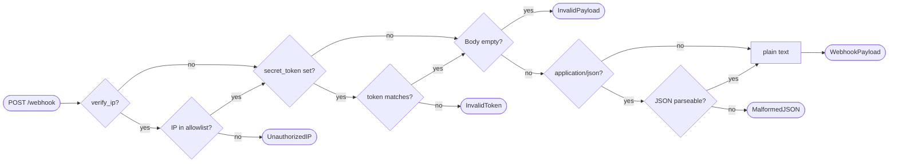

# tradingview-webhook — Request Flow

```mermaid
graph LR
    A([POST /webhook]) --> B{verify_ip?}

    B -- yes --> C{IP in allowlist?}
    B -- no --> F

    C -- no --> D([UnauthorizedIP])
    C -- yes --> F

    F{secret_token set?} -- yes --> G{token matches?}
    F -- no --> J

    G -- no --> H([InvalidToken])
    G -- yes --> J

    J{Body empty?} -- yes --> K([InvalidPayload])
    J -- no --> L{application/json?}

    L -- yes --> M{JSON parseable?}
    L -- no --> P[plain text]

    M -- no --> N([MalformedJSON])
    M -- yes --> P

    P --> Q([WebhookPayload])
```
