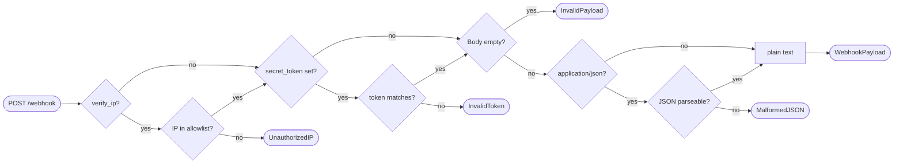

# tradingview-webhook

A lightweight, framework-agnostic Python package for receiving and validating TradingView webhook alerts.

**What it does:**
- Validates the sender IP against TradingView's known IP allowlist
- Validates a secret token embedded in the alert JSON body
- Parses the body (JSON or plain text) into a clean `WebhookPayload` object
- Raises typed exceptions for every failure mode so your app can respond correctly

**What it does NOT do:**
- Execute trades or call external APIs
- Manage a server or listen on a port (that's Flask/FastAPI's job)

---

## How TradingView webhooks work

1. You deploy a server (Flask/FastAPI app) to a VPS or cloud host
2. Your server gets a public URL, e.g. `https://yourserver.com/webhook`
3. You paste that URL into TradingView's alert settings (once)
4. When an alert fires, TradingView POSTs to your URL
5. Your route function calls this package to validate and parse the payload
6. You act on the signal

---

## Installation

Install directly from GitHub:

```bash
pip install git+https://github.com/ZB-Bondy/tradingview-webhook.git
```

With Flask extras:

```bash
pip install "git+https://github.com/ZB-Bondy/tradingview-webhook.git#egg=tradingview-webhook[flask]"
```

With FastAPI extras:

```bash
pip install "git+https://github.com/ZB-Bondy/tradingview-webhook.git#egg=tradingview-webhook[fastapi]"
```

---

## Quickstart

### Flask

```python
import os
from flask import Flask, request
from tradingview_webhook import WebhookHandler, WebhookError
from tradingview_webhook.integrations.flask_handler import from_flask_request

app = Flask(__name__)
handler = WebhookHandler(secret_token=os.getenv("TV_SECRET_TOKEN"))

@app.route("/webhook", methods=["POST"])
def webhook():
    try:
        payload = from_flask_request(request, handler)
        print(payload.raw)        # e.g. {"token": "...", "signal": "buy", "ticker": "BTCUSD"}
        print(payload.sender_ip)  # e.g. "52.89.214.238"
        print(payload.received_at)
        return "", 200
    except WebhookError as e:
        return str(e), 403

if __name__ == "__main__":
    app.run(port=5000)
```

### FastAPI

```python
import os
from fastapi import FastAPI, HTTPException, Request
from tradingview_webhook import WebhookHandler, WebhookError
from tradingview_webhook.integrations.fastapi_handler import from_fastapi_request

app = FastAPI()
handler = WebhookHandler(secret_token=os.getenv("TV_SECRET_TOKEN"))

@app.post("/webhook")
async def webhook(request: Request):
    try:
        payload = await from_fastapi_request(request, handler)
        print(payload.raw)
        return {"status": "ok"}
    except WebhookError as e:
        raise HTTPException(status_code=403, detail=str(e))
```

### Raw / no framework

```python
from tradingview_webhook import WebhookHandler

handler = WebhookHandler(secret_token="my-secret")

# Call .process() directly with the raw request components
payload = handler.process(
    body=b'{"token": "my-secret", "signal": "buy"}',
    content_type="application/json",
    sender_ip="52.89.214.238",
)
print(payload.raw)  # {"token": "my-secret", "signal": "buy"}
```

---

## TradingView alert message format

In TradingView's alert settings, set your message to valid JSON including the token field:

```json
{
  "token": "my-secret",
  "signal": "buy",
  "ticker": "{{ticker}}",
  "price": {{close}}
}
```

TradingView will POST this as `application/json`. The `{{ticker}}` and `{{close}}` are TradingView template variables replaced at alert time.

---

## WebhookHandler options

```python
handler = WebhookHandler(
    secret_token="my-secret",  # None = skip token check
    verify_ip=True,            # False = skip IP allowlist check
    dev_mode=False,            # True = shortcut for verify_ip=False, logs a warning
)
```

| Option | Default | Description |
|---|---|---|
| `secret_token` | `None` | Token to match against `token` field in JSON body |
| `verify_ip` | `True` | Reject requests from IPs not in TradingView's allowlist |
| `dev_mode` | `False` | Disables IP check (use with ngrok for local testing) |

### TradingView's known IPs

```
52.89.214.238
34.212.75.30
54.218.53.128
52.32.178.7
```

---

## Exceptions

All exceptions inherit from `WebhookError` so you can catch everything with one clause or be specific:

```python
from tradingview_webhook import (
    WebhookError,    # base — catch all
    UnauthorizedIP,  # sender IP not in TV allowlist
    InvalidToken,    # token field missing or wrong
    MalformedJSON,   # body claimed to be JSON but wasn't parseable
    InvalidPayload,  # body is empty or unreadable
)
```

---

## Logging

The package logs under the `tradingview_webhook` logger using Python's standard `logging` module. Configure it in your app:

```python
import logging
logging.basicConfig(level=logging.INFO)
# or just the package:
logging.getLogger("tradingview_webhook").setLevel(logging.DEBUG)
```

Log levels used:

| Level | When |
|---|---|
| `DEBUG` | Every incoming request (IP, processing steps) |
| `INFO` | Successfully accepted webhook |
| `WARNING` | Rejected request (bad IP, bad token) or dev_mode active |

---

## Local testing with ngrok

TradingView can't reach `localhost`, so use [ngrok](https://ngrok.com/) to expose your local server:

```bash
# 1. Start your Flask/FastAPI app locally (e.g. on port 5000)
python app.py

# 2. In another terminal, start ngrok
ngrok http 5000

# 3. ngrok prints a public URL like: https://a1b2c3.ngrok.io
# 4. Paste https://a1b2c3.ngrok.io/webhook into TradingView's alert settings
```

Since ngrok's IPs don't match TradingView's allowlist, use `dev_mode=True`:

```python
handler = WebhookHandler(secret_token="my-secret", dev_mode=True)
```

Switch back to `dev_mode=False` (the default) before deploying to production.

---

## Production deployment (VPS)

On a VPS you already have a public IP — no ngrok needed.

```bash
# With Flask + gunicorn
pip install gunicorn
gunicorn app:app --bind 0.0.0.0:80

# With FastAPI + uvicorn
pip install uvicorn
uvicorn app:app --host 0.0.0.0 --port 80
```

Point TradingView to `http://YOUR_VPS_IP/webhook` (port 80) or your domain over HTTPS (port 443).

> Note: TradingView only accepts ports 80 and 443. IPv6 is not supported.

---

## TradingView webhook retry behaviour

If your server returns a 5xx response (except 504), TradingView will retry up to 3 times (5 seconds apart), for a maximum of 4 total deliveries. Your server must respond within **3 seconds** or TradingView will cancel the request.

This means: keep your route fast. Validate, enqueue the signal, return 200 immediately — do the heavy processing in a background task.

---

## Request flow


